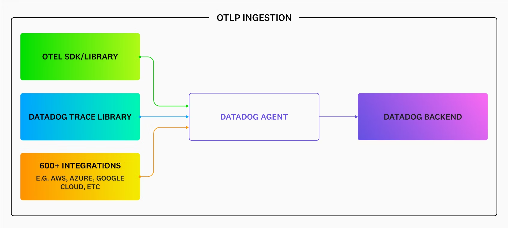
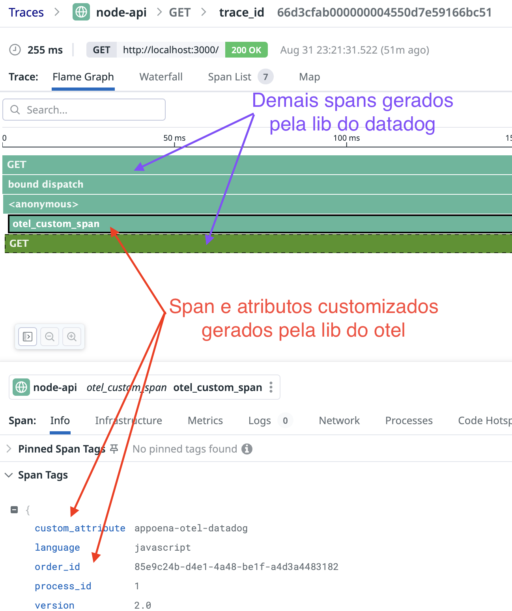
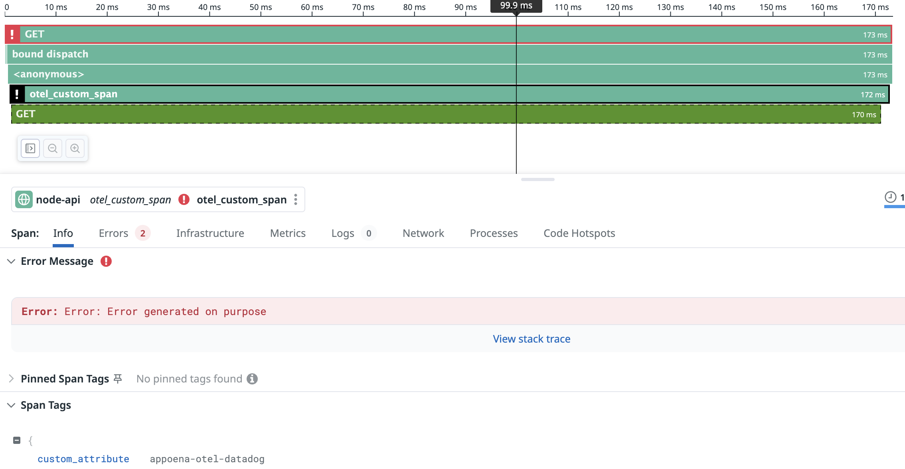

# datadog-otel-js-example

O objetivo desse projeto é demonstrar como unificar os spans gerados com a instrumentação automatica do Datadog com spans customizados gerados com opentelemetry.

## Pre requisitos para conseguir executar o projeto

- docker
- docker-compose

## Como rodar a aplicação

Configure a variavel de ambiente com a API Key da sua conta no Datadog:

```bash
export DD_API_KEY=YOUR_DATADOG_API_KEY
```

### Como subir a aplicação

```bash
docker-compose up -d --build --remove-orphans
```

### Como acessar a aplicação

No seu navegador basta acessar o endereço [http://localhost:3000](http://localhost:3000)

### Como derrubar a aplicação

```bash
docker-compose down --remove-orphans
```

## Como funciona?

O agent do Datadog é capaz de receber tanto os spans gerados pelas bibliotecas de spans do Datadog (dd-trace) como os spans gerados pelas bibliotecas do opentelemetry(otel). Esse funcionamento está detalhado no desenho abaixo



O agent do Datadog faz o merge entre os spans, garantindo que todos os spans sejam parte do mesmo trace.

Dessa forma é possível  aproveitar features que o Datadog oferece (ex.: AppSec, Data Streams Monitoring, Dynamic Instrumentation, etc...) e usar o otel para instrumentações customizadas, evitando o vendor lockin.

## O que é importante saber

Sobre o código da aplicação, os comentários em [node-api/index.js](node-api/index.js) explicam o que precisa ser feito.

A variável `DD_TRACE_OTEL_ENABLED` é obrigatória na aplicação para o correto funcionamento dessa estratégia, ela que "faz o merge" entre os traces do datadog e otel

Ainda na aplicação a variável `OTEL_EXPORTER_OTLP_ENDPOINT` define para onde os spans do otel serao enviados (datadog-agent)  

No agent, as variáveis `DD_OTLP_CONFIG_RECEIVER_PROTOCOLS_GRPC_ENDPOINT` e `DD_OTLP_CONFIG_RECEIVER_PROTOCOLS_HTTP_ENDPOINT` são obrigatórias, elas que dizem para o agent que ele deve receber dados gerados pelas libs do otel. Nao esquecer também de expor as portas para que a aplicaçao seja capaz de enviar os spans para esse endereço e porta.

## Validando o funcionamento

Após subir a aplicaçao e acessar algumas vezes, será possível acessar os traces em APM > Traces no Datadog, basta filtrar por `service:node-api`

Ao abrir um trace esse deve ser o resultado:


Exemplo de erro(erro gerado de forma randômica, acesse algumas vezes para ter um exemplo):



## Como replicar na sua aplicação?

### 1. Instale as libs do otel

```bash
npm install @opentelemetry/api@1.8.0 @opentelemetry/exporter-trace-otlp-proto @opentelemetry/sdk-node
```

### 2. Adicione as linhas abaixo onde será necessaria a instrumentaçao customizada

```javascript
//importa as libs do otel e inicia o sdk
const { NodeSDK } = require('@opentelemetry/sdk-node');
const {OTLPTraceExporter} = require('@opentelemetry/exporter-trace-otlp-proto');
const sdk = new NodeSDK({
  traceExporter: new OTLPTraceExporter()
});
sdk.start();

//obtem o tracer, necessario para a instrumentaçao customizada
const { trace, SpanStatusCode } = require('@opentelemetry/api');
const tracer = trace.getTracer();
```

### 3. Instrumente sua aplicação com opentelemetry

Verifique no código como criar spans `tracer.startActiveSpan()` e atributos customizados `span.setAttribute()`: [node-api/index.js](node-api/index.js) 

Ex.:

```javascript
tracer.startActiveSpan('otel_custom_span', (span) => {  
  span.setAttribute('custom_attribute','appoena-otel-datadog');
  // Seu código aqui
});
```

### 4. Instrumente sua aplicação com Datadog

Seguir os passos conforme documentação do Datadog: [Tracing Node.js Applications](https://docs.datadoghq.com/tracing/trace_collection/automatic_instrumentation/dd_libraries/nodejs/)

### 5. Variaveis de ambiente da aplicação

Configure o endpoint do agent que irá receber os spans e habilita o otel no tracer do Datadog:

```bash
DD_TRACE_OTEL_ENABLED=true
OTEL_EXPORTER_OTLP_ENDPOINT=http://datadog-agent:4318
```

Consulte o docker-compose em caso de dúvidas: [docker-compose](./docker-compose.yaml)


### 6. Variaveis de ambiente no agent do Datadog

Configure as variáveis de ambiente no agent do Datadog e garanta que as portas `4317` e `4318` sejam acessiveis pelas aplicações que enviarão os spans do opentelemetry:

```bash
DD_OTLP_CONFIG_RECEIVER_PROTOCOLS_GRPC_ENDPOINT=0.0.0.0:4317
DD_OTLP_CONFIG_RECEIVER_PROTOCOLS_HTTP_ENDPOINT=0.0.0.0:4318
```

Além disso, configurar o agent para que ele receba os traces do proprio Datadog atraves da porta 8126 ou via udp, consultar doc do Datadog. Caso seu ambiente seja em kubernetes ou outro tipo, consulte [a doc do Datadog para esse passo](https://docs.datadoghq.com/containers/kubernetes/apm/?tab=helm).

Consulte o docker-compose em caso de dúvidas: [docker-compose](./docker-compose.yaml)

## Referências

https://opentelemetry.io/docs/languages/js/instrumentation/#manual-instrumentation-setup
https://docs.datadoghq.com/opentelemetry/
https://docs.datadoghq.com/opentelemetry/interoperability/otlp_ingest_in_the_agent/?tab=docker
https://docs.datadoghq.com/opentelemetry/interoperability/instrumentation_libraries/?tab=java